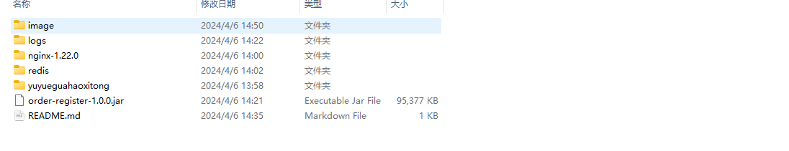
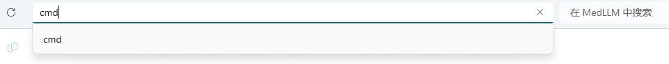
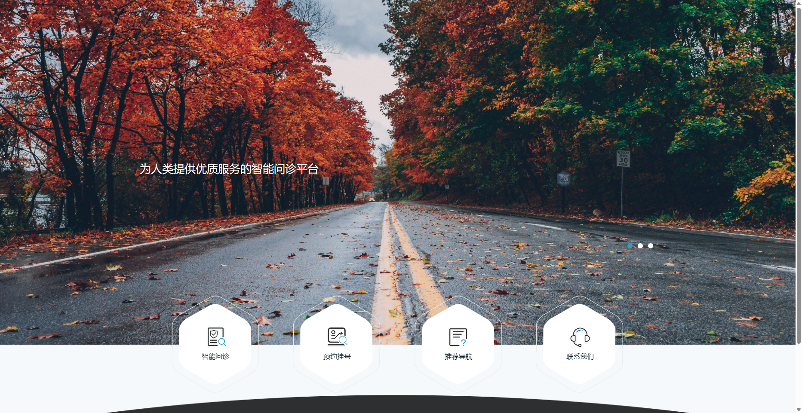

# MedLLM——基于大语言模型的导诊系统

## 关于如何本地运行

#### 页面目录如图



#### 1.前端启动

进入nginx-1.22.0，双击nginx.exe


#### 2.后端启动

- 进入redis，双击redis-server.exe


- 打开该文件目录的命令提示符，直接运行jar包

  

运行jar包
  ```
  java -jar order-register-1.0.0.jar
  ```

#### 3.打开页面localhost:80



## 项目成员信息

成员皆来自NCWU的wqKang开发组

- 202107927 康问樵
- 202108913 张皓
- 202110209 朱金舟
- 202109723 傅家俊
