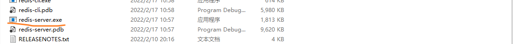

# MedLLM——基於大語言模型的導診系統


## 專案成員信息

成員皆來自NCWU的wqKang開發組：

- 202107927 康問樵
- 202108913 張皓
- 202110209 朱金舟
- 202109723 傅家俊

## 聯繫方式

如有任何問題或建議，請通過郵件聯繫：wenqiaokang@outlook.com

## 關於如何本地運行

### 頁面目錄如圖


### 1. 前端啟動

在`nginx-1.22.0`目錄中，雙擊`nginx.exe`啟動。


### 2. 後端啟動

- 進入`redis`目錄，雙擊`redis-server.exe`啟動Redis伺服器。



- 在專案檔案目錄中打開命令提示符，執行以下命令啟動後端服務：

```bash
java -jar order-register-1.0.0.jar
```

#### 3. 打開頁面 `localhost:80`

在瀏覽器中輸入地址 `localhost:80`，即可訪問系統頁面。


